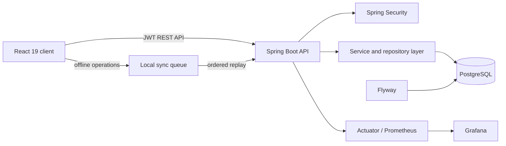

# FocusFlow

FocusFlow is an offline-first task management application built as a production-style full-stack portfolio project. It combines a responsive React workspace with a secured Spring Boot API, PostgreSQL persistence, conflict-aware synchronization, automated tests, observability, and containerized local deployment.

## Highlights

- Email/password registration and login with short-lived JWT access tokens.
- Rotating, revocable refresh tokens stored as hashes in the database.
- HttpOnly refresh-cookie sessions, active-session management, password policy, login throttling, and SMTP-backed verification/recovery flows.
- Workspaces with owner/admin/member/viewer roles, activity events, task comments, and authenticated attachments stored locally or in S3-compatible storage.
- Strict per-user ownership for tasks, lists, subtasks, and trash.
- Offline-first mutations persisted locally and replayed in order after reconnecting.
- Idempotent task creation and optimistic locking to prevent duplicate or lost updates.
- Soft delete, restore, permanent delete, search, Matrix, Habits, and persisted Pomodoro sessions.
- A real task-backed weekly calendar, list/Kanban views, filters, drag-and-drop ordering, and command palette.
- Recurrence that creates the next occurrence, persistent reminders, browser notifications, priorities, tags, subtasks, assignees, custom lists, and due dates.
- Profile and timezone settings, email verification demo flow, password recovery/change, and account deletion.
- Installable PWA shell with offline reload support in addition to the mutation sync queue.
- PostgreSQL migrations with Flyway and an optional file-backed H2 demo profile.
- Health/readiness probes, Prometheus metrics, Grafana, Docker Compose, CI, CodeQL, and Trivy.
- Unit, integration, ownership-isolation, concurrency-conflict, responsive E2E, and build checks.

## Architecture



The client uses stable UUIDs and a per-user local cache. Mutations are applied optimistically, coalesced where possible, and replayed sequentially. The API validates ownership on every query and supports idempotency plus entity versions for conflict detection.

## Stack

| Area | Technology |
| --- | --- |
| Frontend | React 19, TypeScript, Vite, Lucide |
| Backend | Java 21, Spring Boot 3.4, Spring Security, Spring Data JPA |
| Data | PostgreSQL 17, Flyway, H2 demo/test profile |
| Operations | Docker Compose, Nginx, Prometheus, Grafana |
| Quality | Vitest, Testing Library, Playwright, JUnit, MockMvc, CodeQL, Trivy |

## Quick start with Docker

Requirements: Docker Desktop with Compose.

```powershell
Copy-Item .env.example .env
docker compose up --build
```

Open:

- Application: <http://localhost:8080>
- API documentation: <http://localhost:8085/swagger-ui.html>
- Health check: <http://localhost:8085/actuator/health>

Demo credentials:

```text
Email: demo@todo.local
Password: TodoDemo!2026
```

To include local monitoring:

```powershell
docker compose --profile monitoring up --build
```

- Prometheus: <http://localhost:9090>
- Grafana: <http://localhost:3001> (user `admin`, password from `GRAFANA_PASSWORD`)

Stop the stack without deleting its database:

```powershell
docker compose down
```

## Local development

### Backend with PostgreSQL

Set the values from `.env.example`, start PostgreSQL, then run:

```powershell
Set-Location backend
.\mvnw.cmd spring-boot:run
```

The API listens on `http://localhost:8085`.

For a zero-setup demo using a file-backed H2 database:

```powershell
Set-Location backend
.\mvnw.cmd spring-boot:run -Dspring-boot.run.profiles=demo
```

### Frontend

```powershell
npm ci
npm run dev
```

The Vite development server listens on `http://localhost:5173`. Override the API URL with `VITE_API_BASE_URL` when necessary.

If port 8080 is already in use, set `FRONTEND_PORT=8088` in `.env` and open `http://localhost:8088`.

## API overview

| Route | Purpose |
| --- | --- |
| `POST /api/v1/auth/register` | Create an account and return a session |
| `POST /api/v1/auth/login` | Authenticate a user |
| `POST /api/v1/auth/refresh` | Rotate the refresh token |
| `POST /api/v1/auth/logout` | Revoke a refresh token |
| `GET/DELETE /api/v1/auth/sessions` | Inspect and revoke browser sessions |
| `GET /api/v1/auth/me` | Return the current user |
| `PATCH /api/v1/auth/profile` | Update display name and timezone |
| `POST /api/v1/auth/change-password` | Change the authenticated user's password |
| `POST /api/v1/auth/forgot-password` | Create a short-lived recovery token |
| `POST /api/v1/auth/reset-password` | Reset a password with a recovery token |
| `POST /api/v1/auth/email-verification/*` | Request and confirm email verification |
| `DELETE /api/v1/auth/account` | Delete the account and owned data |
| `GET/POST /api/v1/tasks` | Query or create tasks |
| `PUT /api/v1/tasks/{id}` | Update with optional version checking |
| `DELETE /api/v1/tasks/{id}` | Move a task to trash |
| `POST /api/v1/tasks/{id}/restore` | Restore a deleted task |
| `DELETE /api/v1/tasks/{id}/permanent` | Permanently remove a task |
| `GET/POST/DELETE /api/v1/lists` | Manage user-owned lists |
| `GET/POST /api/v1/workspaces` | List and create workspaces |
| `POST/PATCH/DELETE /api/v1/workspaces/{id}/members` | Manage workspace membership and roles |
| `GET/POST/DELETE /api/v1/tasks/{id}/comments` | Collaborate in a task |
| `GET/POST/DELETE /api/v1/tasks/{id}/attachments` | Upload, download, and delete authenticated attachments |
| `GET /api/v1/events` | Authenticated server-sent workspace and notification events |
| `PATCH /api/v1/tasks/bulk` | Apply a workspace-scoped bulk update |
| `GET /api/v1/tasks/calendar.ics` | Export a workspace calendar feed |
| `GET /api/v1/tasks/stats` | Return task aggregates |
| `GET/PATCH /api/v1/notifications` | Read and acknowledge due reminders |
| `GET/POST /api/v1/focus-sessions` | Read and record Pomodoro sessions |

The complete contract and schemas are available in Swagger UI.

## Test and quality commands

```powershell
npm run lint
npm run test:run
npm run build
npm run test:e2e

Set-Location backend
.\mvnw.cmd verify
```

CI repeats linting, tests, builds, dependency auditing, container builds, filesystem vulnerability scanning, and CodeQL analysis.

## Configuration

| Variable | Description | Local default |
| --- | --- | --- |
| `DATABASE_URL` | JDBC PostgreSQL connection URL | `jdbc:postgresql://localhost:5432/todoapp` |
| `DATABASE_USERNAME` | Database user | `todoapp` |
| `DATABASE_PASSWORD` | Database password | `todoapp` |
| `JWT_SECRET` | HMAC signing secret, at least 48 random characters recommended | development only |
| `ACCESS_TOKEN_SECONDS` | Access token lifetime | `900` |
| `REFRESH_TOKEN_DAYS` | Refresh token lifetime | `30` |
| `CORS_ALLOWED_ORIGINS` | Comma-separated frontend origins/patterns | localhost and Vercel preview |
| `SEED_DEMO_DATA` | Seed the demo account and starter tasks | `true` |
| `VITE_API_BASE_URL` | Public API base URL used during frontend build | `http://localhost:8085/api/v1` |
| `FRONTEND_PORT` | Host port exposed by the Docker frontend | `8080` |
| `EMAIL_ENABLED` / `MAIL_*` | Enable SMTP delivery for verification, reset, and reminders | disabled |
| `STORAGE_PROVIDER` | `local` or `s3` attachment storage | `local` |
| `S3_BUCKET`, `AWS_REGION`, `S3_ENDPOINT` | S3/MinIO attachment configuration | none |
| `COOKIE_SECURE`, `COOKIE_SAME_SITE` | Refresh-cookie transport policy | `false`, `Lax` |

Never reuse the development JWT or database secrets in a public environment.

Development may expose verification/recovery tokens for the demo flow. The `prod` profile disables that behavior and sends links through SMTP instead.

## Production notes

The project demonstrates production-oriented boundaries. See [docs/PRODUCTION.md](docs/PRODUCTION.md) for the exact deployment contract, MinIO staging override, recovery drill, edge restrictions, and the remaining multi-node realtime requirement.

See [docs/ARCHITECTURE.md](docs/ARCHITECTURE.md) for synchronization, security, data ownership, and deployment decisions.
